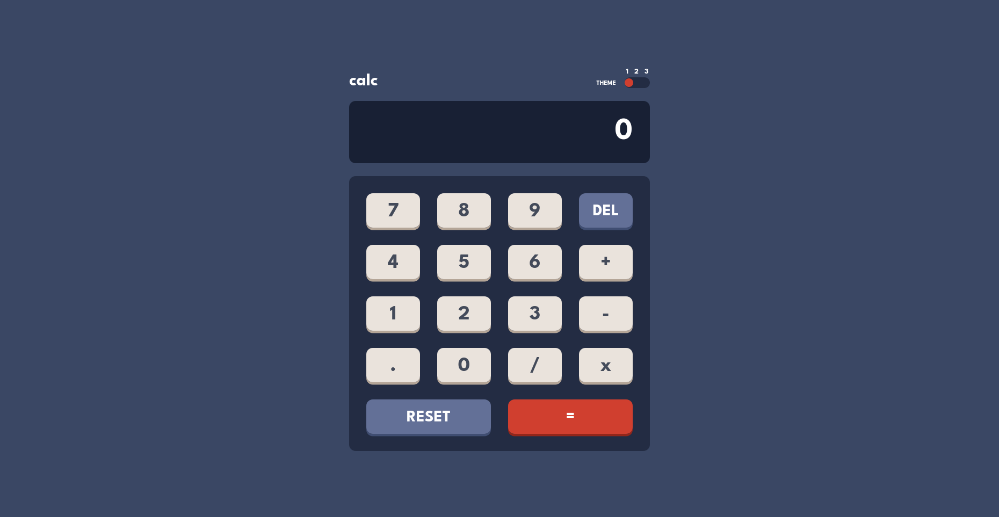

# Frontend Mentor - Calculator app solution

This is a solution to the [Calculator app challenge on Frontend Mentor](https://www.frontendmentor.io/challenges/calculator-app-9lteq5N29). Frontend Mentor challenges help you improve your coding skills by building realistic projects.

## Table of contents

- [Overview](#overview)
  - [The challenge](#the-challenge)
  - [Screenshot](#screenshot)
  - [Links](#links)
- [My process](#my-process)
  - [Built with](#built-with)
- [Author](#author)

## Overview

### The challenge

Users should be able to:

- See the size of the elements adjust based on their device's screen size
- Perform mathmatical operations like addition, subtraction, multiplication, and division
- Adjust the color theme based on their preference
- **Bonus**: Have their initial theme preference checked using `prefers-color-scheme` and have any additional changes saved in the browser

### Screenshot

### Links

- Solution URL: [Github URL](https://github.com/kbrownw/CalculatorApp)
- Live Site URL: [Live Site URL](https://calculator-by-keith.web.app/)

## My process

### Built with

- Semantic HTML5 markup
- CSS custom properties
- Flexbox
- CSS Grid
- Mobile-first workflow
- [React](https://reactjs.org/) - JS framework
- [Vite](https://vitejs.dev/) - Devolopement Environment
- [Typescript](https://www.typescriptlang.org/) - Javascript with syntax for types.
- [TailwindCSS](https://tailwindcss.com/) - For styles
- [FramerMotion](https://www.framer.com/motion/) - For animations

## Author

- LinkedIn - [Keith Brown](https://www.linkedin.com/in/keith-brown-b9a3a32a2/)
- Frontend Mentor - [@kbrownw](https://www.frontendmentor.io/profile/kbrownw)
- Github - [https://github.com/kbrownw](https://github.com/kbrownw)
